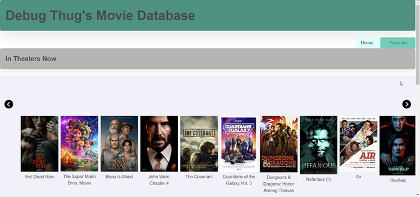

# Movie Lovers

## Description

As big movie lovers we created a list of movies that are coming soon as well as movies that are in theaters. We wanted to be able to save the movies that we were looking forward to or is our favorite movie that we've seen this year.

We wanted to make sure that the data that we're pulling is dynamic, so when we click on a movie, it pulls in all the right data so it's all dynamic.

## Table of Contents

- [Installation](#installation)
- [Usage](#usage)
- [Credits](#credits)
- [Future Features](#future-features)

## Installation

No need to install anything, just need the links below.

Github: https://github.com/christinahoang32/debug-thugs  
Final Link: https://christinahoang32.github.io/debug-thugs/  

## Usage

When you first access the page, an api will pull a list of the movies that are in theaters. You can click on the round arrow buttons to scroll right and left.  

  

 When you click on a movie poster image, it will pull up a modal with information about the movie. At the bottom of the modal there's a like button that you can click to save your favorite movies to local storage.

  

 When you click on like in the modal from the main page, it will add all the movies you liked into this favorite page.

## Credits

**Contributors:**  
Bia Shimizu-Reynolds: https://github.com/luxardOri  
Christina Hoang: https://github.com/christinahoang32  
Jordan Lockhart: https://github.com/liljlock  
Matt Miceli: https://github.com/Matty-Bamboo  
Renzo San Juan: https://github.com/renzosj  

**Third-party Assets**  
Bulma CSS Framework: https://bulma.io/  

**Tutorials:**  
Modal Tutorial: https://www.w3schools.com/howto/howto_css_modals.asp  
Web Carousel: https://web-crunch.com/posts/tailwind-css-movie-production-landing-page  
YouTube Tutorials: https://www.youtube.com/@ProgrammingDuck  

**Tutors:**  
Francisco Rivera  
Kenny Igbechi  
Erik Hirsch (tutoring session)  
Mila Hose (tutoring session)  

## Future Features

Register and login feature